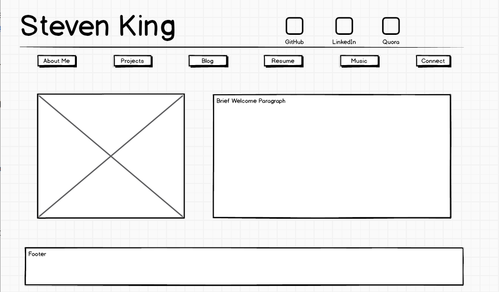
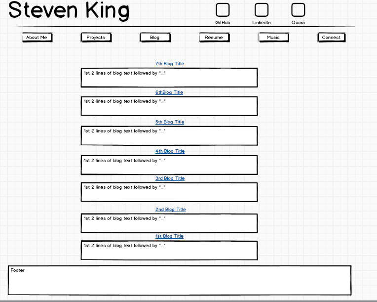

####What is a wireframe?

A wireframe is a 2d black and white (or perhaps greyscale) version of a website, used to help design a website. 

####What are the benefits of wireframing?

It allows a designer to plan how content will be laid onto the page without worrying about fonts and colors. It's also the time when a designer will plan out how navigation will work. It's a time to notice when things aren't as they should be before moving further into the finer points of design or development stages. For example, maybe an image should be higher up on the page or there are too many options in the navigation bar. 

####Did you enjoy wireframing your site?

I did enjoy wireframing. I used Balsamiq, which at first had a lot of options and seemed confusing. But as I looked at it more from a "what tools do I need" instead of "What do all these things mean?" perspective, it was easy to work with. 

####Did you revise your wireframe or stick with your first idea?

I revised my wireframe idea. I started out with an even more simple concept but then realized I needed to change some things in order to have a picture on the page as well. 

####What questions did you ask during this challenge? What resources did you find to help you answer them?

I wanted to see examples. I used Grantland.com, a site I used to visit quite often before it was shut down, for inspiration. I also just did a few google image searches for ideas. 

####Which parts of the challenge did you enjoy and which parts did you find tedious?

I enjoyed working with Balsamiq. On my blog wireframe, I basically decided to do the same thing for all seven blog posts which was a bit tedious and repetitive. It's also the section I'm least confident in. I may end up changing the design of that one. 