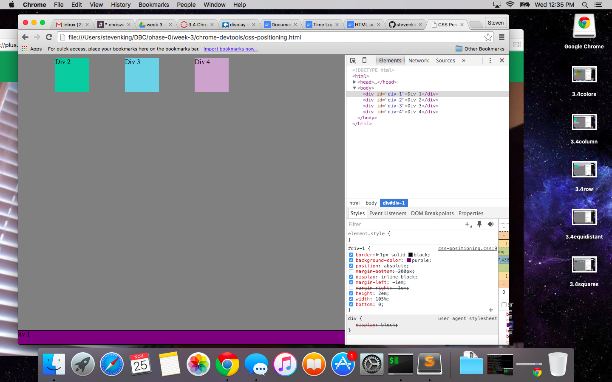

##3.4 Pairing Challenge Reflection

Quick Comment: I realized after I completed this challenge that I'd misread the instructions and my pair and I did not refresh our page before starting each exercise. I thought it best to display the work that we did do together here.

####How can you use Chrome's DevTools inspector to help you format or position elements?

Chrome's DevTools are great for working with CSS! It was a nice change of pace to be able to see our work as we did it, rather than moving back and forth between sublime and a web browswer. Incredibly helpful!

####How can you resize elements on the DOM using CSS?

The main way we resized elements was using the height and width keys.

####What are the differences between absolute, fixed, static, and relative positioning? Which did you find easiest to use? Which was most difficult?

If you don't specificy any position at all, the element becomes set to "static". This means if you don't tell it where to go, it just sets itself into the document.

Absolute positioning puts the element in relation to its parent element. So if you start giving it positioning like "margin", it'll put the margin between that and its parent element. If there's not one, it moves from what appears to be the top left of the page.

Relative positioning just moves the element based on where it otherwise would've gone. So it doesn't move it "away" from anything, just away from where it would be.

Fixed positioning keeps the element where it is even if someone scrolls up, down, left, or right.

####What are the differences between margin, border, and padding?

A margin is the space between elements. A border is the actual border around the element. Like a picture frame almost. Padding is the space between the content of an element and its border. We learned in this challenge that if you give a div padding, it'll fill up all that space w/ color if its colored. Margins were much more useful!

####What was your impression of this challenge overall? (love, hate, and why?)

I actually thought it went better than I thought. CSS positioning has been the toughest thing for me to get a handle on in DBC so far. I'm a bit upset that I misread the instructions and maybe made it easier or harder on myself than how the challenge was intended. BUT - I do feel like I understand a lot of the concepts more than I did before. Chris was a great pair and he made the challenge fun!