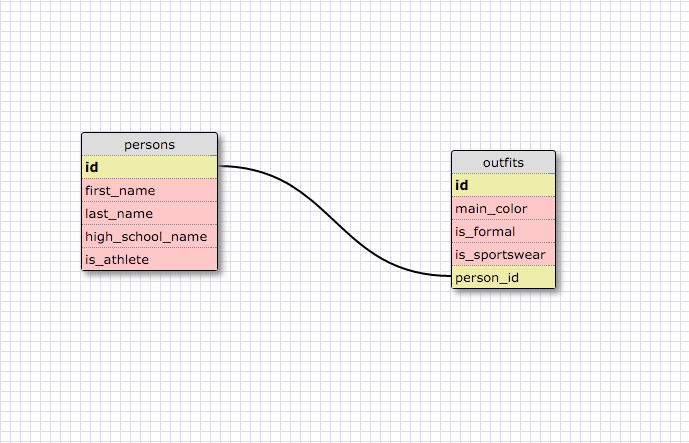

###SQL Commands used

1. SELECT * FROM states;

2. SELECT * FROM regions;

3. SELECT state_name, population FROM states;

4. SELECT state_name, population
   FROM states
   ORDER BY population DESC;

5. SELECT state_name FROM states
   WHERE region_id=7;

6. SELECT state_name, population_density
   FROM states
   WHERE population_density>50
   ORDER BY population_density ASC;

7. SELECT state_name FROM states
   WHERE population BETWEEN 1000000 AND 1500000;

8. SELECT state_name, region_id FROM states
   ORDER BY region_id ASC;

9. SELECT region_name FROM regions
   WHERE region_name LIKE '%central%';

10. SELECT regions.region_name, states.state_name
    FROM states
    INNER JOIN regions
    ON regions.id=states.region_id
    ORDER BY region_id ASC;

###My Schema Design

###Reflections

What are databases for?
Simply, they're for storing data. They are superior to storing data
in arrays and hashes because they allow for pages to load faster and
for simpler access to the info stored.

What is a one-to-many relationship?

An example is states belonging to a region and regions containing many
states. It's when one item in a row can refer to many items in a
related row.

What is a primary key? What is a foreign key? How can you determine which is which?

I don't really understand this concept yet. I know we used these to
connect two tables. Wiki says a foreign key is a field in one table
that uniquely identifies a row in another table. I suppose the foreign
key was "region_id" in our exercise. The primary key was 'id'. My not understanding of this was probably evident in my Clueless table
example. I couldn't think of a rational way to relate the two tables
so I just used 'person_id' or something which doesn't seem very
practical. I'll dig more into this.

How can you select information out of a SQL database? What are some general guidelines for that?

I really enjoyed learning this part. The SQL language is really
similar to spoken langue (like ruby).  I almost guessed at things
and it worked.
So, to select something, type SELECT what_you_want_selected FROM table_name. Very simple.
Using ORDER BY helps sort what's selected.
WHERE helps narrow results using operators like >,<,=, etc.