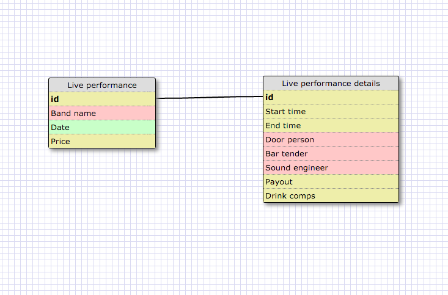
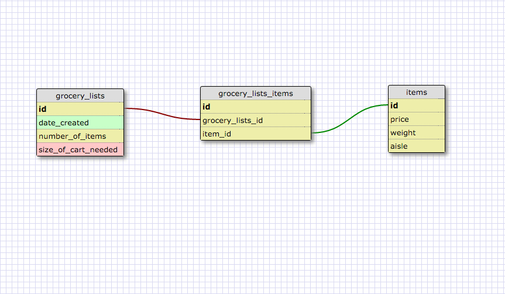

####Release 2:

####Release 4:

####Reflections:

What is a one-to-one database?

A one to one database is something like a pair. The items only belong
to each other. This can be used in a couple of different ways. One is
a more literal pair, like a state only has one capital and a capital
only belongs to one state. The other way is to simplify a more complex
database. Like in my example, a live performance at a music venue
has many different properties but usually someone would only be
referring to a couple of simple things. So you can split off all the
details into a separate database. The two databases are one-to-one.
They both only describe the same event.

When would you use a one-to-one database? (Think generally, not in terms of the example you created).

Oops, see above for examples! In general, a one-to-one relationship
can be used to simplify(split into two) complex databases or to
describe a pair.

What is a many-to-many database?

A many to many database is when two things are connected but other
things are connected to each. Like, the students/challenges example.

When would you use a many-to-many database? (Think generally, not in terms of the example you created).

You would use a many-to-may database (with a join table!) if you
wanted to connect two databases that occasionally intersected with
each other but were not exclusively connecting with each other.

What is confusing about database schemas? What makes sense?

It's actually really hard to explain without using examples! If I read
my own descriptions without having examples it'd be hard for me to
even understand. So, they're somewhat confusing in theory though
are easy to understand when applied to something. I'm still probably
the most confused by one-to-many relationships which wasn't what this
particular challenge dealt with. One-to-one relationships make the
most sense to me.